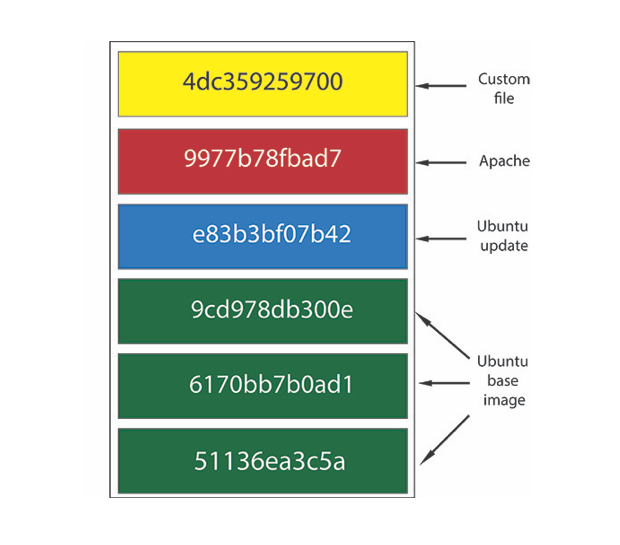

% 🐍 🐳 w/ Docker w/ Security in Mind
% Nahuel Defossé (@D3f0)
% June 2019

----

# Goals

Be able to create a Python application with Docker,
with a *reasonable security level by default*.

Structure project for docker.

----

## Further reading

I wrote an more  in-depth article at my company's website:
[https://engineering.spideroak.com/single-dockerfile-across-environments/](https://engineering.spideroak.com/single-dockerfile-across-environments/)

----

# Virtualization Basics

- Virtual Machines
- Hypervisors
- Operating System Level Virtualization/Isolation

----

## Virtual Machines

- Hard Disk images take big space (GBs)
- Boot up times are in the order of minutes
- Allocate a fixed amount of RAM (can be GBs)
- Are not so easy to distribute
  - i.e.: ISOs are not virtual Machines
  - Vagrant Boxes are not easy to distribute

----

### VMs Strengths

- Can run any Operating System
- Provide good isolation
- Mature technology
- Widely available

----

## Hypervisor

- Software/Firmware/Hardware that creates/runs VMs.
- Abstract the real resources from the VM

----

- Classified as:
  - Native (Level 1)
    - Xen, Oracle VM Server, Hyper-V, VMWare ESX/ESXi
  - Hosted (Level 2)
    - VMWare Workstation/Player, VMWare, Parallels, QEMU

----

- Linux KVM and BSD bhyve fall between the L1 and L2
  - Implemented as kernel modules


----

## OS Virtualization/Isolation

- LXC
- BSD Jails
- Solaris Zones
- Open Private Server (OpenVZ)
- **Docker** containers

----

# Containers

----


----

- Have a small disk footprint
- Use less RAM than a real VM
- Only provide *one service* 🤔
- Can be started in seconds

----

## Docker

----


----

### Running an image

Running a well known web server docker image.

```bash
docker run --name my_container nginx -p 80:80
```

... prduces:

```
Unable to find image 'nginx:latest' locally
latest: Pulling from library/nginx
fc7181108d40: Pull complete
c4277fc40ec2: Pull complete
780053e98559: Pull complete
Digest: sha256:bdbf36b7f1f77ffe7bd2a32e59235dff6ecf131e3b6b5b96061c652f30685f3a
Status: Downloaded newer image for nginx:latest
```

----

Now we can browser [http://localhost:80](http://localhost:80)

----

## What just happened?

- Docker pulled the image from the public registry `hub.docker.com`
- A container was created with a random name
- That container was started
- The host machine port 80 was mapped to the container's 80

----

### Inspecting the container

We're root

```
$ docker exec my_container id
uid=0(root) gid=0(root) groups=0(root)
```

Which processes are present?

```
 docker exec my_container ps
OCI runtime exec failed: exec failed: container_linux.go:344: starting container process caused "exec: \"ps\": executable file not found in $PATH": unknown`
```

----

This image does not include **ps**.

It's a good practice only include the minimal elements for you application to run.

Less attack surface and smaller image sizes.

----

### Let's check Python image

[https://hub.docker.com/_/python](https://hub.docker.com/_/python)

----

```bash
docker run --name my_py_img --tty --interactive ipython:3.7

Python 3.7.2 (default, Feb  6 2019, 12:04:03)
[GCC 6.3.0 20170516] on linux
Type "help", "copyright", "credits" or "license" for more information.
>>> import os
>>> os.system('ps')
  PID TTY          TIME CMD
    1 pts/0    00:00:00 python3
    6 pts/0    00:00:00 sh
    7 pts/0    00:00:00 ps
0
>>>
```

----

## 🤨

This image seems to have more things than `ps`.

```
$ docker images python:3.7
REPOSITORY    TAG    IMAGE ID       CREATED        SIZE
python        3.7    338b34a7555c   4 months ago   927MB
```


```bash
$ docker run --rm python:3.7 gcc
gcc: fatal error: no input files
compilation terminated.
```

----

## 🤨

### This image is bing enough to have a full Linux distro

Probably it's not the best thing to ship ⛵️

----

We need a way to reduce the size of our images, thus our containers.

But first we need to understand how storage works in a container.

----

### Container Storage

----

#### Images 📦

- Docker **images** are the base file system that the container
will see at runtime.

- **Images** is composed of layers 🍰, and will be created from
either a tar-file or building a Dockerfile.

----

#### Layers 🍰




----

#### We can actually look at layers...

```bash
docker history python:3.7 --no-trunc

IMAGE               CREATED             CREATED BY                                      SIZE                COMMENT
338b34a7555c        4 months ago        /bin/sh -c #(nop)  CMD ["python3"]              0B
<missing>           4 months ago        /bin/sh -c set -ex;   wget -O get-pip.py 'ht…   6.04MB
<missing>           4 months ago        /bin/sh -c #(nop)  ENV PYTHON_PIP_VERSION=19…   0B
<missing>           4 months ago        /bin/sh -c cd /usr/local/bin  && ln -s idle3…   32B
<missing>           4 months ago        /bin/sh -c set -ex   && wget -O python.tar.x…   70.3MB
<missing>           4 months ago        /bin/sh -c #(nop)  ENV PYTHON_VERSION=3.7.2     0B
<missing>           4 months ago        /bin/sh -c #(nop)  ENV GPG_KEY=0D96DF4D4110E…   0B
<missing>           4 months ago        /bin/sh -c apt-get update && apt-get install…   17MB
<missing>           4 months ago        /bin/sh -c #(nop)  ENV LANG=C.UTF-8             0B
<missing>           4 months ago        /bin/sh -c #(nop)  ENV PATH=/usr/local/bin:/…   0B
<missing>           4 months ago        /bin/sh -c set -ex;  apt-get update;  apt-ge…   560MB
<missing>           4 months ago        /bin/sh -c apt-get update && apt-get install…   142MB
<missing>           4 months ago        /bin/sh -c set -ex;  if ! command -v gpg > /…   7.81MB
<missing>           4 months ago        /bin/sh -c apt-get update && apt-get install…   23.2MB
<missing>           4 months ago        /bin/sh -c #(nop)  CMD ["bash"]                 0B
<missing>           4 months ago        /bin/sh -c #(nop) ADD file:4fec879fdca802d69…   101MB
```

----

### Container storage

- When the process writes to the filesystem, a new layer is produced.
- It's kept during the lifetime of the container.
- Changes are lost when the container is removed.

The good news is that all containers share the image, and won't take
space, unless they write

----

#### Volumes

- To overcome the problem of transient storage docker provides volumes.
- Types of volumes:
  - **un-named** when we define the exact place where files are stored

    **Must be absolute 🌡**
  - **named** when we let the Docker Engine define where our files will go.

----

```bash
$ docker run --rm -ti -v $(pwd):/code python:3.7 bash
root@d2b4492f3aa8:/# cd /code/
root@d2b4492f3aa8:/code# ls
root@d2b4492f3aa8:/code# touch main.py
root@d2b4492f3aa8:/code# exit
```

```bash
$ ls -ls
total 0
0 -rw-r--r-- 1 root root 0 Jun 14 16:59 main.py
```

----

Wait, weren't we **`uid=0`**? 🔥

----

## Network

----

- Each container runs by default in the Docker bridge.
- Unless we connect them at creation time (`run` or `create`)
  with a network.

```bash
docker network ls
NETWORK ID          NAME                DRIVER              SCOPE
84422e48e242        bridge              bridge              local
fbca96234ec6        host                host                local
f6effdb82553        none                null                local
```

----


----

# Image Creation

-----

- In order to create images we need to write a `Dockerfile`
- Run `docker build -t <tag> context dir` (context dir is usually the current
directory or `.`)
- If we tag images with repository URLS, then we'll be able to push them.


----

```
FROM python:3.7-slim
ENV USER=user UID=1000

LABEL maintainer=me@mycompany.com

RUN groupadd -g ${UID} -r ${USER} \
    && useradd -u ${UID} -r -g ${USER} ${USER}
COPY requirements.txt /setup/requirements.txt
RUN pip install /setup/requirements.txt
COPY . /code
WORKDIR /code
USER ${USER}
VOLUME /some_storage
EXPOSE 8000
RUN python myapp.py
```

----

- Use reputed images from Registry in the **FROM**
  - If not, check Dockerfile to be minimal
    - and be automated
    - or at least official (run `docker search term`)
  - Or purchase Docker EE whose registry
- Resist temptation to use `VOLUME` for the code (at least
  until we learn about compose 😅)
- Use small as possible images


----

#### Building binary packages 🔨

```
FROM python:3.6-slim AS python-builder
RUN pip install -U pip
# Overwrite symlink contents
COPY /requirements-bin.txt
RUN mkdir /wheels
RUN cd /wheels && pip wheel -r /requirements-bin.txt

# Final image
FROM python:3.6-slim
# ...
RUN adduser --disabled-password --gecos "" ${USER} && \
    chown -R ${USER} /home/${USER}
COPY --from=python-builder /wheels/dist/ /wheels
RUN cd /wheels && pip install *.whl

```

----

- Don't use root for runtime, create a user.
- Separate layers that produce big and rare changes
  like `pip install` to the top. Help the caché invalidation.
- Install requirements as root
  - and then demote yourself to your `USER`.

----

- If dynamic startup is needed, add an `ENTRYPOINT`
- You can write it in Python if you want.
- This can make the *image* part *production rady™* and
  augment your image for development.

----

# Docker Projects

----

- Rarely our application just relies in Python, we probably
  need DBs, IoT brokers, authentication providers, etc.
- Some development tasks are hard to accomplish from the
  `docker run` itself.
- Docker compose allows us to define:

  - services
  - networks
  - volumes

----

```yaml
services:

  myapp:
    build: ./webapp
    ports:
      - 8080:80
    environment:
      DB_HOST: postgresql
      PYTHONPATH: /home/user/.local/lib/python3.7/site-packages/
    volumes:
      - /webapp/code:/code
      - local_dev_pkgs:/home/user/.local/lib/python3.7/site-packages/
    restart: unless-stopped

  postgresql:
    image: postgresql:10
```


----

To bring up our project like this

```bash
$ docker-compose up
```

Typical flags are `docker up --build -d` and eventually `docker-compose logs`.

----

#### Runtime augmentation

- Put development requirements in volumes:
  - Define `PYTHONPATH` in `docker-compose.yml`'s `environment`
  - We can take advantage of `/home/user/.local` and run `pip install --user`.
- Create an entrypoint and check different behaviors based on
  environment.
- You can defined a custom entrypoint in your compose file, so
  your image is always production ready.

----

```bash
#!/bin/bash
set -e
cmd="$@"

if [ "${ENV:dev}" != "prod" ]; then
    # Custom environment setup
    if [ -z "${SKIP_SETUP}" -a -d "/shared/${ENV}" ]; then
        for f in /shared/${ENV}/*; do
            case "$f" in
            *.sh)     echo "$0: running $f"; . "$f" ;;
            *.py)     echo "$0: running $f"; python "$f"; echo ;;
            *)        echo "$0: ignoring $f" ;;
            esac
            echo "Finished ${ENV} setup. Running $cmd"
        done
    fi
fi

# Django specific
if [ -z "${SKIP_COLLECTSTATIC}" ]; then
    echo "Running collect static"
    python manage.py collectstatic --noinput
fi

exec $cmd
```

This is bash, but could easily be achieved with Python.

----

## Development sidecars

- You can put a separate `docker-compose.yml` and
  and call compose like:

  ```
  docker-compose.yml -f docker-compose.yml -f dev.yml
  ```

----

#### `dev.yml`

```yaml
version: '3.5'
services:
  jupyter:
    image: my_other_image
    user: root  # 😱
    ports:
      - 8889:8888
    volumes:
      - .:/code
      - local_cache:/root/.local
    working_dir: /code
    command: python /code/dev_entrypoint.py
    labels:
      - "not.for.prod"
      - "comment=🇰🇪"
volumes:
  local_cache:

```

----

#### A sketchy 🐍 entrypoint

```python
#!/usr/bin/env python
import sys
import os
import subprocess
import shlex
from pathlib import Path


CMD = sys.argv[1:]

if not CMD:
    CMD = shlex.split(
        "jupyter lab --ip='0.0.0.0' --port=8888 --no-browser --notebook-dir=/code "
        "--allow-root --NotebookApp.token='' --NotebookApp.allow_remote_access=True"
    )


def run(command, can_fail=False):
    try:
        subprocess.check_call(shlex.split(command))
    except subprocess.CalledProcessError:
        if not can_fail:
            raise


def local_pip(name, can_fail=False):
    # The user make the package to end in the volume
    return run(f"pip install --user {name}", can_fail=can_fail)


def check_install(name):
    try:
        __import__(name)
    except ImportError:
        local_pip(name)

os.environ["PATH"] = "{HOME}/.local/bin:{PATH}".format(**os.environ)
os.environ["PYTHONPATH"] = (
    "{HOME}/.local/lib/python3.6/site-packages/:"
    # Allow to import the testing utilities from jupyter
    "/code/src/tests"
).format(
    **os.environ
)

run("jupyter nbextension enable --py widgetsnbextension")
run("jupyter serverextension enable --py jupyterlab")

os.execvp(CMD[0], CMD)

```


----

## The end

---

## Questions?
